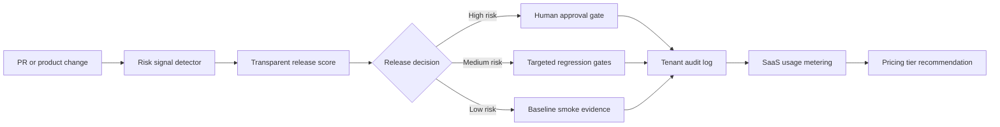

# Sentinel SaaS

AI release-risk platform for SaaS teams shipping with AI coding agents.

Sentinel SaaS scans a product or code change, detects release risk across payments, authentication, customer data, AI-agent tools, webhooks, and workflow state, then generates security regression gates, an audit trail, and a usage-metered SaaS pricing recommendation.

## Why This Fits Galuxium Nexus V2

Galuxium Nexus V2 asks builders to ship monetizable SaaS platforms, not throwaway prototypes. Sentinel SaaS is designed around that mandate:

- **Live product workflow:** Paste a release change and get an immediate release decision.
- **Enterprise governance:** Every scan produces transparent risk evidence, human approval gates, and tenant audit events.
- **Monetization:** Pricing tiers and usage-based overages are built into the product, not added as a slide.
- **Market fit:** AI coding tools make teams ship faster, but release safety, security review, and audit evidence are still bottlenecks.
- **Judge-friendly proof:** The repo includes a web app, tested Python agent engine, generated demo evidence, API server, and Devpost copy.

## Live Demo

For local review:

```powershell
python -m http.server 5173 --directory web
```

Open:

```text
http://127.0.0.1:5173
```

The static web demo also works from `galuxium_sentinel_saas/web/index.html`.

## Run The Agent Engine

Generate judge artifacts:

```powershell
python sentinel_saas_agent.py demo
```

Analyze a custom change:

```powershell
python sentinel_saas_agent.py analyze demo_input\sample_pr.json --tenant acme-finance --monthly-usage 420
```

Run the local API:

```powershell
python sentinel_saas_agent.py serve --host 127.0.0.1 --port 8091
```

API smoke test:

```powershell
Invoke-RestMethod -Method Post -Uri http://127.0.0.1:8091/analyze -ContentType 'application/json' -Body (Get-Content demo_input\sample_pr.json -Raw)
```

## Run Tests

```powershell
python -m unittest discover -s tests
```

## Demo Scenario

The included sample change ships an AI-assisted refund approval flow. It touches:

- AI agent tool use
- Payment and refund logic
- Authentication and role checks
- ERP webhook sync
- Customer audit payloads

Sentinel SaaS detects the combined risk, assigns a **96/100 release risk score**, blocks the release pending human review, generates security regression gates, and writes audit evidence.

## Generated Artifacts

After `python sentinel_saas_agent.py demo`:

- `demo_output/analysis_result.json` - full machine-readable analysis
- `demo_output/executive_brief.md` - judge and executive summary
- `demo_output/tenant_audit_log.json` - tenant-level audit events
- `demo_output/pricing_model.json` - SaaS pricing tiers

## Architecture



## Tech Stack

- Python standard library agent engine
- Static HTML, CSS, and JavaScript web app
- Local HTTP API using `ThreadingHTTPServer`
- JSON and Markdown evidence exports
- `unittest` verification suite
- Netlify/Vercel-ready static deployment config

No paid API key is required to run the demo. The product is designed so an OpenAI or other LLM adapter can be added later for deeper semantic review while keeping the deterministic risk engine as the auditable baseline.

## Monetization Model

| Tier | Monthly price | Included scans | Overage |
| --- | ---: | ---: | ---: |
| Starter | INR 999 | 50 | INR 35/scan |
| Growth | INR 4,999 | 500 | INR 18/scan |
| Enterprise | INR 24,999 | 5,000 | INR 8/scan |

The business model is simple: teams pay for release scans, governance evidence, and audit history as AI-generated code volume grows.

## Submission Assets

- Devpost copy: `docs/DEVPOST_COPY.md`
- Video script: `docs/VIDEO_SCRIPT.md`
- Architecture details: `docs/ARCHITECTURE.md`
- Strategy checklist: `docs/SUBMISSION_STRATEGY.md`
- Optional OpenAI agent contract: `docs/OPENAI_AGENT_CONTRACT.md`
- Devpost gallery image: `assets/devpost_gallery.png`
- Browser verification screenshot: `assets/browser_view.png`

## Safety And Scope

Sentinel SaaS is intentionally conservative. It does not auto-approve high-risk payment, authentication, AI-agent, webhook, or customer-data changes. High-risk releases require human approval and evidence capture before production.
