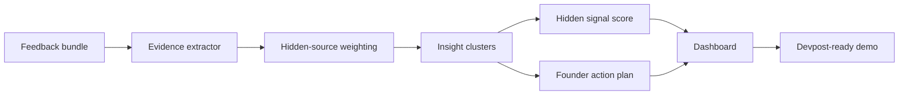

# Hidden Reviews AI

Domain Roulette project for **hidden.reviews**.

Hidden Reviews AI finds the customer feedback that teams miss because it is scattered across Reddit, GitHub issues, app reviews, Discord/community posts, support tickets, and sales notes. The agent clusters that buried evidence into product-risk patterns and generates a founder-ready action plan.

## Why This Fits DeveloperWeek NYC / name.com Domain Roulette

The track rewards creative interpretation of a real domain, technical execution, product polish, concept strength, and domain connection.

**hidden.reviews** is a literal product idea:

- The most valuable reviews are often hidden outside formal review pages.
- Founders need those scattered signals before churn or lost deals make the problem obvious.
- The product turns the domain into a useful customer-intelligence command center.

## Live Demo

Local static demo:

```powershell
python -m http.server 5174 --directory web
```

Open:

```text
http://127.0.0.1:5174
```

The browser demo also works by opening `web/index.html`.

## Run The Agent

Generate the full demo artifact package:

```powershell
python hidden_reviews_agent.py demo
```

Analyze custom feedback:

```powershell
python hidden_reviews_agent.py analyze demo_input\sample_feedback.json --customer-count 1800
```

Run the local API:

```powershell
python hidden_reviews_agent.py serve --host 127.0.0.1 --port 8092
```

API smoke test:

```powershell
Invoke-RestMethod -Method Post -Uri http://127.0.0.1:8092/analyze -ContentType 'application/json' -Body (Get-Content demo_input\sample_feedback.json -Raw)
```

## Tests

```powershell
python -m unittest discover -s tests
```

## Demo Scenario

The sample analyzes a fictional SaaS product, **NimbusLedger**. The feedback is scattered across:

- Reddit thread
- GitHub issue
- App review
- Sales call note
- Support email
- Community Discord

Hidden Reviews AI finds a **97/100 hidden signal score**, with pricing trust as the top risk, plus integration reliability, onboarding confusion, executive visibility, and competitor pressure.

## Generated Artifacts

After `python hidden_reviews_agent.py demo`:

- `demo_output/analysis_result.json`
- `demo_output/founder_brief.md`
- `demo_output/evidence_events.csv`
- `demo_output/domain_pitch.md`
- `demo_output/pricing_model.json`
- `demo_output/dashboard_report.html`

## Architecture



## Tech Stack

- Python standard library
- Static HTML, CSS, JavaScript
- Local HTTP API
- JSON, CSV, and Markdown evidence exports
- `unittest`
- OpenAI-ready agent contract
- Base44-ready entity/function outline

No paid API key is required for the submitted demo.

## SaaS Model

| Tier | Price | Included feedback items | Buyer |
| --- | ---: | ---: | --- |
| Scout | $29/mo | 250 | Solo founders and student startup teams |
| Growth | $149/mo | 7,500 | SaaS teams with public communities and support queues |
| Command Center | $499/mo | 30,000 | Product orgs tracking many products or regions |

## Submission Files

- Devpost copy: `docs/DEVPOST_COPY.md`
- Demo script: `docs/VIDEO_SCRIPT.md`
- Domain strategy: `docs/DOMAIN_ROULETTE_STRATEGY.md`
- OpenAI contract: `docs/OPENAI_AGENT_CONTRACT.md`
- Base44 outline: `base44/README.md`
- Gallery image: `assets/devpost_gallery.png`
