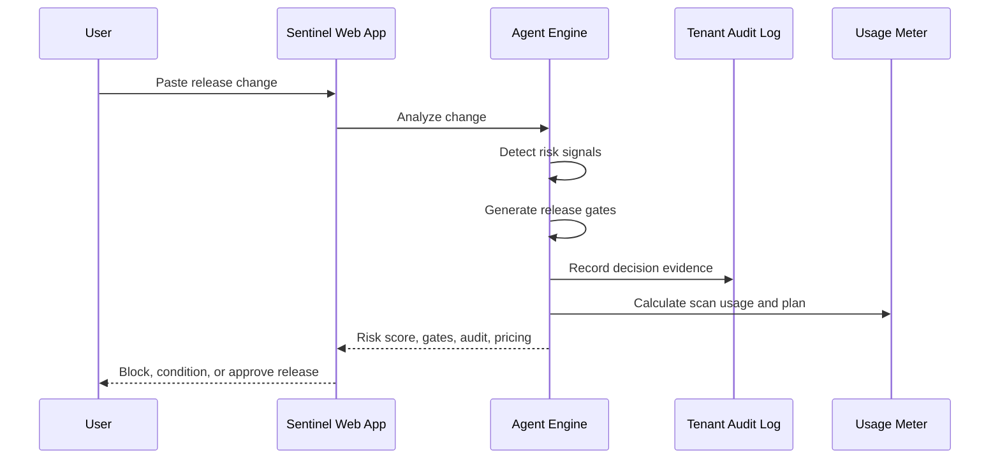

# Architecture

## Product Contract

Sentinel SaaS accepts a release change and returns:

- Risk signals
- Release risk score
- Release decision
- Security regression gates
- Tenant audit events
- Recommended pricing tier
- Usage metering

## Components

### Static Web App

Path: `web/`

The web app is a browser-only SaaS dashboard. It mirrors the deterministic agent logic so judges can try the core workflow without starting a backend. The UI focuses on release decision, risk evidence, regression gates, tenant audit, and pricing.

### Python Agent Engine

Path: `sentinel_saas_agent.py`

The engine is the auditable source of truth. It parses release changes, detects risk categories, scores risk, generates gates, records audit events, and exports demo artifacts.

### Local API

Command:

```powershell
python galuxium_sentinel_saas\sentinel_saas_agent.py serve --host 127.0.0.1 --port 8091
```

Endpoints:

- `GET /health`
- `GET /pricing`
- `POST /analyze`

### Evidence Exports

Path: `demo_output/`

Generated files:

- `analysis_result.json`
- `executive_brief.md`
- `tenant_audit_log.json`
- `pricing_model.json`

## Data Flow



## Security Posture

Sentinel SaaS is conservative by design:

- High-risk releases are blocked pending human review.
- Payment, auth, data, AI-agent, and webhook risks trigger targeted gates.
- Tenant audit events preserve decision evidence.
- The scoring model is transparent instead of opaque.

## Production Roadmap

1. Connect to GitHub PR webhooks.
2. Store tenant scans in Postgres.
3. Add SSO and organization policies.
4. Add optional OpenAI semantic review adapter.
5. Add CI status checks that block risky releases.
6. Add Stripe billing for subscription and overage metering.
