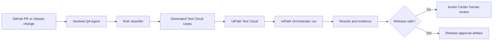

# UiPath Integration Guide

## Target Architecture

## UiPath Assets To Create

- Folder: `Sentinel QA Agent`
- Test set: `Sentinel Release Gate`
- Test cases:
  - `SQA-001-PAYMENT`
  - `SQA-002-AUTHENTICATION`
  - `SQA-003-AI-AGENT`
  - `SQA-004-EXTERNAL-INTEGRATION`
  - `SQA-005-STATE-MACHINE`
  - `SQA-006-USER-EXPERIENCE`
- Queue: `SentinelReleaseReview`
- Action Center process: `Review Blocked Release`

## API Payloads

Generated locally:

- `demo_output/uipath_test_set_payload.json`
- `demo_output/uipath_action_center_tasks.json`

## Minimum Live Integration For Submission

If Labs access arrives late, implement only this live path:

1. Import generated cases into Test Cloud manually or through available API.
2. Run one test set manually.
3. Export the result evidence.
4. Show Sentinel consuming the result and blocking release.

That is enough to prove platform usage if the video clearly shows UiPath Test Cloud in the loop.

## Stretch Integration

1. GitHub webhook triggers Sentinel.
2. Sentinel creates/updates Test Cloud cases.
3. Orchestrator launches the test set.
4. Failed results create Action Center review tasks.
5. A PR comment receives the release decision.
